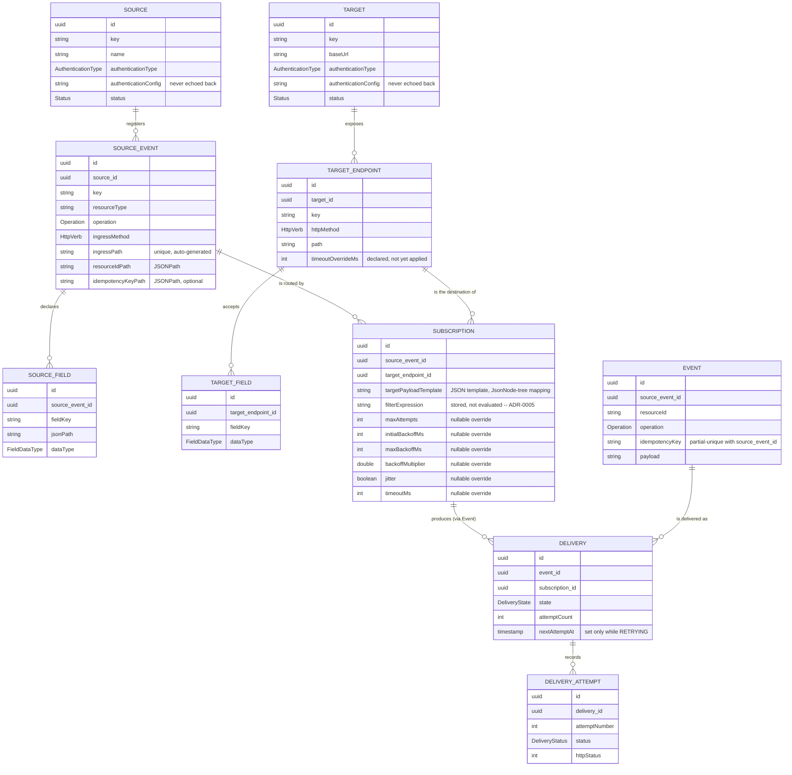
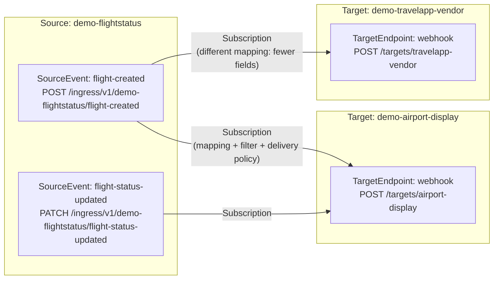
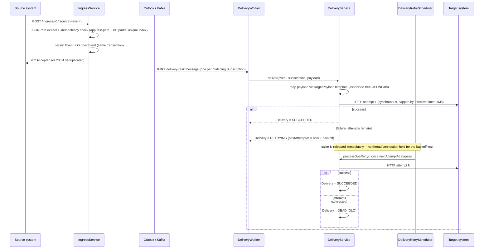
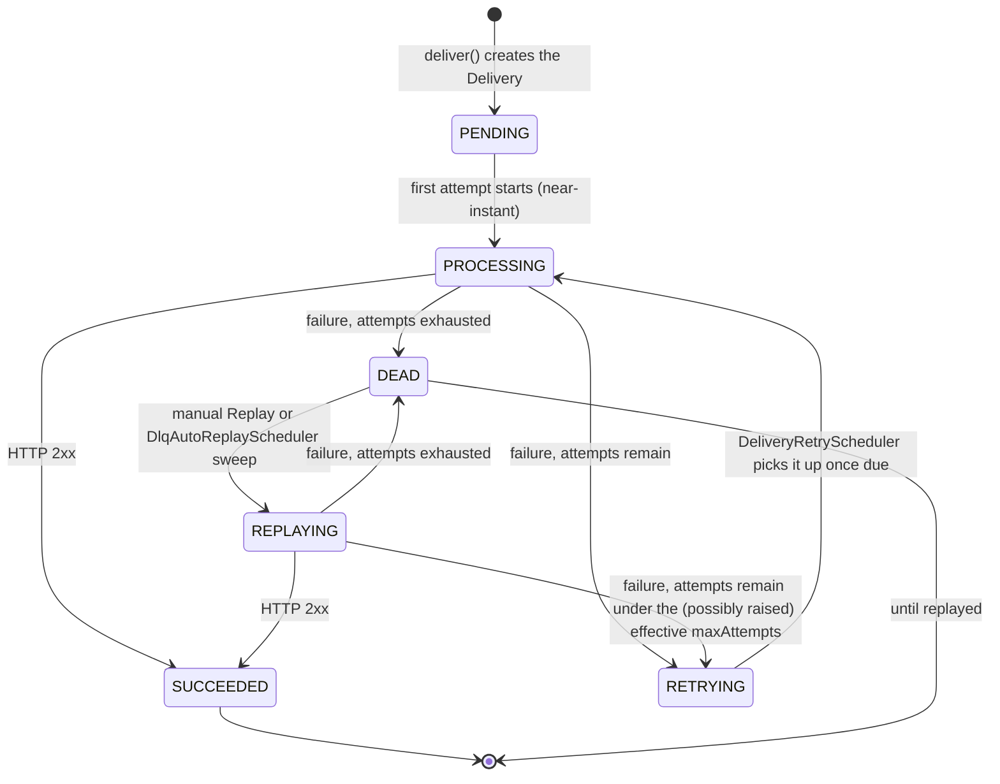

> 이 문서는 [`domain-model.md`](domain-model.md)의 한국어 번역본입니다. 영어 원본이 canonical이며, 충돌 시 영어 원본이 우선합니다.

# Domain Model (현재 상태)

이 문서는 RelayHub의 domain model, delivery pipeline, Delivery/DLQ/Replay state machine의 현재 정확한 모습입니다 — `system-design.md`의 원래 MVP 시절 표(accepted design context로서 역사적 기록으로 그대로 남겨둠)와 달리 실제 코드와 계속 동기화됩니다. integration-platform domain-model overhaul(maintainer 요청, 2026-09-30, 서로 독립적으로 배포된 3단계 stage)를 반영합니다 — 각 stage의 구현/검증 일자별 기록은 `docs/status/current-state.md` 참고.

## 왜 바뀌었나

이 overhaul 이전에는 `Target`에 endpoint별 request shape가 없었고(`TargetField`가 `Target`에 직접 scoped), `Subscription`이 실제 API contract 대신 raw `targetMethod`/`targetPath` 쌍을 들고 있었으며, Subscription별 retry 튜닝이 아예 존재하지 않았습니다(모든 것에 고정된 global backoff 스케줄 하나뿐). 목표는 RelayHub가 단순한 event-delivery demo가 아니라 "실제 시스템 연동을 등록하고 운영하는" 것처럼 보이고 동작하게 만드는 것이었습니다 — Source/Target에 payload envelope를 강제하지 않고, 기존 Subscription을 깨뜨리지 않고, production data를 drop/reseed하지 않으면서요 (이 문서의 모든 변경이 실제 production data에 대해 어떻게 additive하게 적용됐는지는 `docs/decisions/ADR-0004-flyway-and-delivery-dedup.md`와 `src/main/resources/db/migration/`의 Flyway migration들 참고).

## Entity relationships

overhaul 이전 구조 대비 주요 변경점:

- **`TargetEndpoint`** (신규, Stage 1)가 `Target`과 `TargetField`/`Subscription` 사이에 들어갑니다 — 하나의 Target(하나의 시스템, 하나의 `baseUrl`)이 서로 다른 method/path/request shape를 가진 여러 API contract를 노출할 수 있습니다. 반대편에서 `SourceEvent`가 이미 `Source`와 `SourceField`/`Subscription` 사이에 있던 것과 같은 구조입니다.
- **`Subscription`**은 이제 raw `(targetId, method, path)` 세 값이 아니라 `TargetEndpoint`를 참조합니다 — endpoint 자체가 곧 API contract입니다. 또한 nullable한 DeliveryPolicy override 필드(Stage 1에서 컬럼/API만 추가, Stage 2에서 실제 retry engine에 연결)와 `filterExpression`(저장만 되고 평가되진 않음 — `docs/decisions/ADR-0005-subscription-filter-deferred.md` 참고)이 추가됐습니다.
- **`AuthenticationType`** (신규, Stage 1)은 `Source`/`Target` 양쪽에 기존부터 있던 free-text `authenticationConfig` 옆에 추가된 typed enum입니다. `NONE`/`API_KEY`만 실제로 동작하고 콘솔에서 선택 가능하며, `HMAC`/`OAUTH2`/`BEARER_TOKEN`/`BASIC`은 나중에 마이그레이션 한 번 더 없이 값 집합을 넓힐 수 있도록 선언만 해뒀습니다 — 아무것도 아직 읽지 않고, 콘솔도 일부러 이 값들을 선택지로 제공하지 않습니다(동작하지 않는데 동작하는 것처럼 보이지 않도록). `authenticationConfig`는 secret입니다: 한 번 설정되면 API가 절대 되돌려주지 않습니다(Stage 3에서 실제 버그 하나를 고쳤습니다 — 아래 "Known gaps" 참고).
- **`Delivery.state`**에 원래 있던 `PENDING`/`SUCCEEDED`/`DEAD`에 더해 `PROCESSING`/`RETRYING`/`REPLAYING`이 추가됐습니다(Stage 2) — 아래 "Delivery / DLQ / Replay state machine" 참고.

## Source → Subscription → Target 관계

하나의 `SourceEvent`는 여러 `TargetEndpoint`로 fan-out될 수 있고(각각 자신만의 `Subscription`, 자신만의 mapping, 선택적으로 자신만의 delivery-policy override를 통해), 하나의 `TargetEndpoint`도 여러 `SourceEvent`로부터 받을 수 있습니다 — 이 many-to-many join이 바로 `Subscription`입니다. 위 demo 시나리오(`DemoDataSeeder`)가 production에서 실제로 이 구조를 실행 중입니다.

## Event delivery flow

## Delivery / DLQ / Replay state machine

Stage 2(non-blocking retry engine)에서 바뀐 부분:

- Stage 2 이전에는 전체 multi-attempt retry loop가 하나의 `Thread.sleep` 기반 호출 안에서 동기적으로 실행되면서, backoff 스케줄 내내 Kafka consumer thread와 DB connection을 붙잡고 있었습니다. retry 도중 crash가 나면 남은 스케줄이 통째로 사라졌습니다.
- Stage 2 이후에는 한 번에 하나의 HTTP attempt만 동기적으로 진행되고, `RETRYING` + `nextAttemptAt`은 재시작을 버텨내는 영속적인 대기 상태입니다(`DeliveryRetryScheduler`가 재시작 후에도 due한 `RETRYING` delivery를 찾아 이어서 처리 — `DlqAutoReplayScheduler`가 이미 `DEAD`에 대해 하던 것과 동일한 방식).
- `replay()`가 실패 시 항상 곧바로 `DEAD`로 가지 않고 `RETRYING`으로 재진입하는 것도 Stage 2의 동작 변경입니다: delivery가 `DEAD`가 된 뒤 `maxAttempts`를 올렸다면, replay가 그 추가 시도 횟수를 실제로 활용합니다(예전처럼 무조건 한 번만 더 시도하고 끝나지 않습니다).

Attempt마다의 effective delivery policy (`DeliveryService.resolvePolicy`): `maxAttempts`, `initialBackoffMs`, `maxBackoffMs`, `backoffMultiplier`, `jitter`, `timeoutMs` 각각을 Subscription 자신의 nullable override 값이 있으면 그 값을, 없으면 기본값을 사용합니다 — `maxAttempts`는 DB로 설정 가능한 global default(`DeliverySettingsService`)로 fallback하고, 나머지는 고정 상수(200ms / 30s / 2.0x / jitter 없음 / 10s)로 fallback합니다(이 필드들엔 아직 배포 단위 global 설정이 없기 때문). Backoff는 exponential(`initialBackoffMs * backoffMultiplier^(attemptNumber-1)`, `maxBackoffMs`로 cap)이며, `jitter`가 켜져 있으면 "equal jitter"(절반 고정 + 절반 random)를 적용합니다.

## Known gaps (의도적으로 남겨둔 것 — 실수가 아님)

- **Filter는 저장만 되고 평가되지 않습니다.** `Subscription.filterExpression`에는 evaluator가 없습니다 — 활성 Subscription은 내용과 무관하게 매칭되는 모든 Event를 계속 전달합니다. `docs/decisions/ADR-0005-subscription-filter-deferred.md` 참고. 콘솔의 Filter 탭도 이 문서뿐 아니라 화면 자체에서 명시적으로 알려줍니다.
- **`HMAC`/`OAUTH2`/`BEARER_TOKEN`/`BASIC` authentication type은 선언만 됐을 뿐 동작하지 않습니다** — signing, token-fetch flow, credential injection 중 어느 것도 구현되어 있지 않습니다(콘솔이 이 값들을 선택지로 제공하지 않는 것도 동작하지 않는 기능이 동작하는 것처럼 보이지 않게 하기 위함). ~~오늘 기준 이름 그대로 동작하는 건 `NONE`/`API_KEY`뿐이고, `API_KEY`조차 저장만 될 뿐 실제로 outbound request에 붙지는 않습니다~~ — 2026-09-30(같은 날 follow-up)에 해결됨: `API_KEY`는 이제 양방향 모두 실제로 동작합니다. 공유 `X-Api-Key` 헤더 관례(`common/ApiKeyAuth.java`)를 통해, `authenticationType=API_KEY`인 Source는 이제 그 헤더가 없거나 값이 다른 ingress 요청을 거부하고(`401`, `IngressService.authenticate`), `authenticationType=API_KEY`인 Target은 이제 모든 outbound delivery 시도에 그 헤더가 실제로 붙습니다(`DeliveryService.applyApiKeyHeader`). `NONE`(기존 모든 demo Source/Target)은 영향 없습니다. `ApiKeyAuthenticationTest` 참고.
- **`timeoutMs`는 backoff 타이밍 외에 request 단위로 실제 효과가 있는 유일한 DeliveryPolicy 필드입니다** — circuit breaker는 없고, `TargetEndpoint.timeoutOverrideMs`는 선언만 됐을 뿐 `DeliveryService`가 읽지 않습니다(실제 적용되는 건 Subscription 레벨의 `timeoutMs` override입니다).
- ~~특정 `TargetEndpoint`에 등록된 필드가 `targetPayloadTemplate`이 실제로 참조하는 것과 일치하는지 검증되지 않습니다~~ — 2026-09-30(같은 날 follow-up)에 해결됨: `SubscriptionResponse.mappingWarnings`가 이제 template이 참조하지만 registry에 없는 target field/source JSONPath를 나열합니다(`MappingValidationService`), 매 조회마다 새로 계산됩니다. 여전히 강제 제약은 아닙니다 — Spec 006의 원래 판단을 그대로 유지합니다(`MappingValidationService` 자체 Javadoc 참고) — warning만 있을 뿐 저장을 막지 않습니다. `MappingFieldRegistryValidationTest` 참고.
- **Secret 처리는 "API로 절대 돌려주지 않는다" 수준이지, 완전한 secret manager 연동이 아닙니다** — `authenticationConfig`는 평범한 컬럼이고, API 응답에 절대 포함되지 않는 것으로만 가려집니다. Stage 3에서 실제 버그를 하나 고쳤습니다: `SourceService.update`/`TargetService.update`가 예전엔 저장된 secret을 무조건 덮어써서, edit form을 (항상 비어 있는) 그 필드를 건드리지 않고 저장해도 조용히 기존 secret이 지워졌습니다 — 이제 blank/null이면 기존 값을 그대로 둡니다.
- **`/ingress/v1/**`에 rate limiting이 없습니다** `authenticationType=NONE`인 Source에 대해 — 의도적이고 문서화된 보류이지, 실수가 아닙니다. 전체 근거와 재검토 트리거(실제, 데모가 아닌 Source가 연결되는 것)는 `docs/decisions/ADR-0006-no-ingress-rate-limiting.ko.md` 참고.
