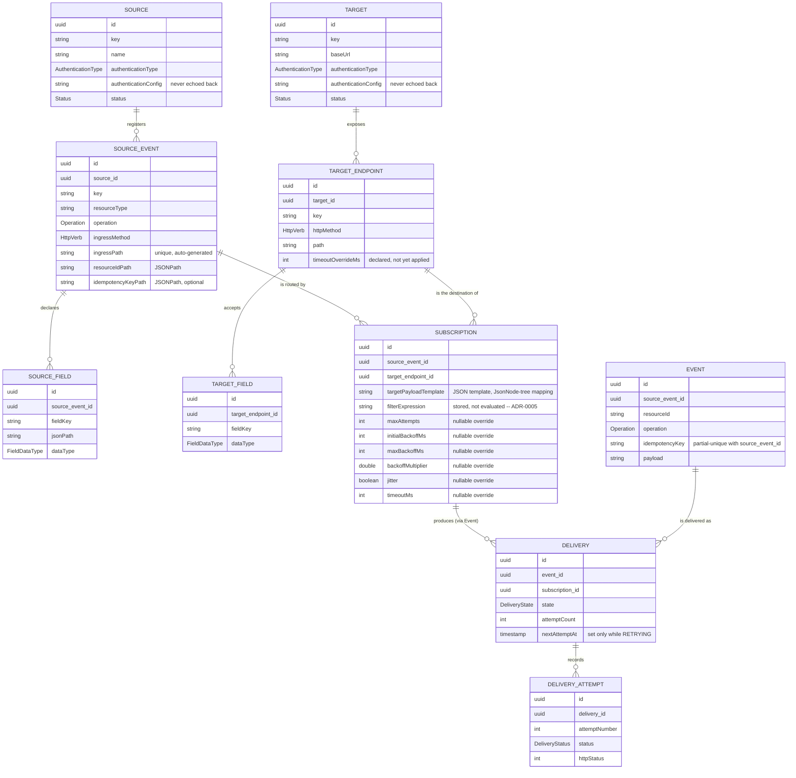
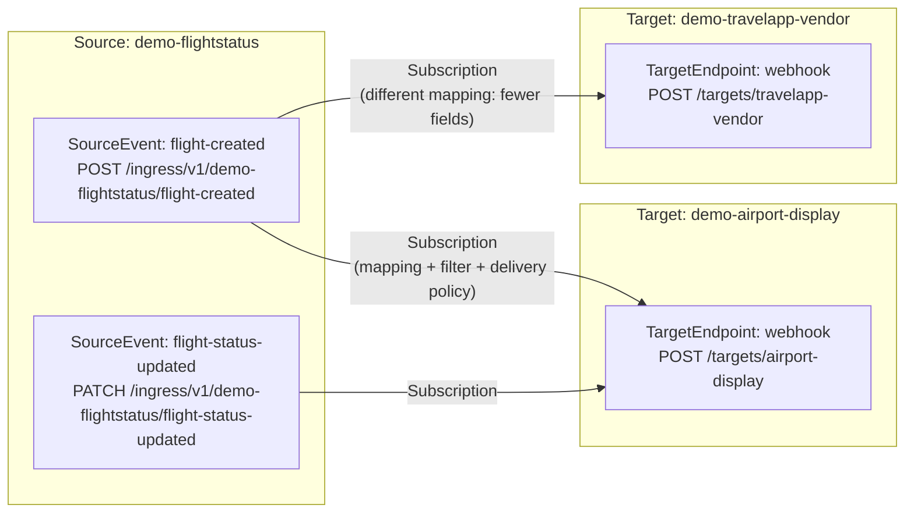
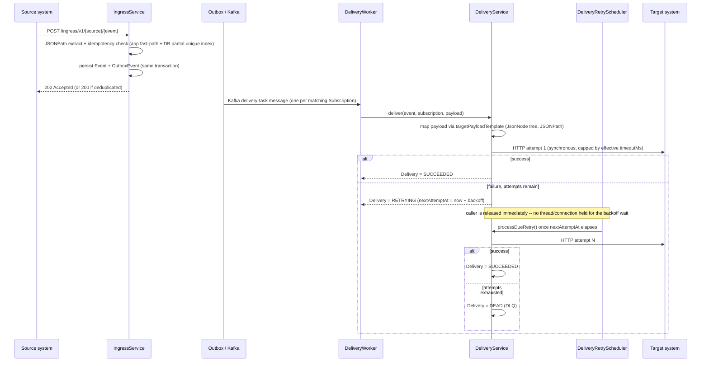
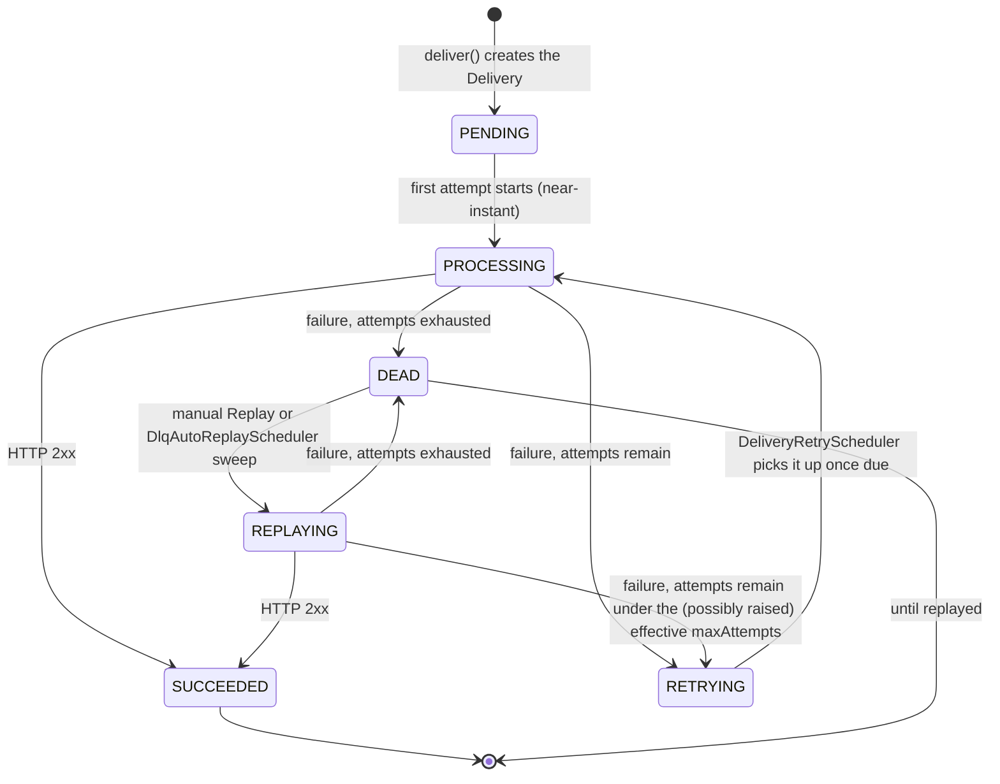

# Domain Model (current)

This document is the current, accurate picture of RelayHub's domain model, delivery pipeline, and
Delivery/DLQ/Replay state machine — kept in sync with the actual code, unlike `system-design.md`'s
original MVP-era tables (which stay as the historical accepted design context; see its own note).
It reflects the integration-platform domain-model overhaul (maintainer request 2026-09-30, three
staged, independently-deployed changes — see `docs/status/current-state.md` for the dated log of
each stage's implementation and verification).

## Why this changed

Before this overhaul, `Target` had no per-endpoint request shape (`TargetField` was scoped directly
to `Target`), `Subscription` carried a raw `targetMethod`/`targetPath` pair instead of referencing a
real API contract, and per-Subscription retry tuning didn't exist (one fixed global backoff
schedule for everything). The goal was to make RelayHub read as "register and operate real system
integrations" rather than a flat event-delivery demo — without forcing a payload envelope on
Source/Target, without breaking any existing Subscription, and without dropping/reseeding
production data (see `docs/decisions/ADR-0004-flyway-and-delivery-dedup.md` and the Flyway
migrations under `src/main/resources/db/migration/` for how every change here was applied
additively against live production data).

## Entity relationships

Key changes from the pre-overhaul shape:

- **`TargetEndpoint`** (new, Stage 1) sits between `Target` and `TargetField`/`Subscription` — one
  Target (one system, one `baseUrl`) can expose several distinct API contracts (different
  method/path/request-shape), mirroring how `SourceEvent` already sat between `Source` and
  `SourceField`/`Subscription` on the other side.
- **`Subscription`** now references a `TargetEndpoint`, not a raw `(targetId, method, path)` triple
  — the endpoint itself *is* the API contract. It also gained the nullable DeliveryPolicy override
  fields (Stage 1 added the columns/API surface; Stage 2 wired them into the actual retry engine)
  and `filterExpression` (stored, not evaluated — see `docs/decisions/ADR-0005-subscription-filter-deferred.md`).
- **`AuthenticationType`** (new, Stage 1) is a typed enum alongside the pre-existing free-text
  `authenticationConfig` on both `Source` and `Target`. Only `NONE`/`API_KEY` are functionally wired
  and selectable in the console; `HMAC`/`OAUTH2`/`BEARER_TOKEN`/`BASIC` are declared so a later stage
  doesn't need another migration just to widen the set, but nothing reads them yet — the console
  deliberately does not offer them, so nothing in the UI looks functional without being so.
  `authenticationConfig` is a secret: the API never echoes it back once set (Stage 3 fixed a real
  bug here — see "Known gaps" below).
- **`Delivery.state`** gained `PROCESSING`/`RETRYING`/`REPLAYING` (Stage 2) alongside the original
  `PENDING`/`SUCCEEDED`/`DEAD` — see "Delivery / DLQ / Replay state machine" below.

## Source → Subscription → Target relationship

One `SourceEvent` can fan out to many `TargetEndpoint`s (each via its own `Subscription`, its own
mapping, and optionally its own delivery-policy override) and one `TargetEndpoint` can receive from
many `SourceEvent`s — the many-to-many join is `Subscription` itself, exactly as the demo scenario
above (`DemoDataSeeder`) exercises live in production.

## Event delivery flow

## Delivery / DLQ / Replay state machine

Notes on what changed in Stage 2 (the non-blocking retry engine):

- Before Stage 2, the entire multi-attempt retry loop ran synchronously inside one `Thread.sleep`-
  based call, holding the Kafka consumer thread and a DB connection for the whole backoff schedule.
  A crash mid-retry lost the rest of the schedule entirely.
- After Stage 2, only one HTTP attempt is ever in flight synchronously; `RETRYING` + `nextAttemptAt`
  is a durable, persisted wait state that survives a restart (`DeliveryRetryScheduler` resumes any
  due `RETRYING` delivery it finds, same as `DlqAutoReplayScheduler` already did for `DEAD`).
- `replay()` re-entering `RETRYING` (rather than always landing straight back on `DEAD`) is itself a
  Stage 2 behavior change: if `maxAttempts` was raised after a delivery went `DEAD`, a replay now
  actually benefits from the additional attempts instead of getting exactly one more try regardless.

Effective delivery policy per attempt (`DeliveryService.resolvePolicy`): each of `maxAttempts`,
`initialBackoffMs`, `maxBackoffMs`, `backoffMultiplier`, `jitter`, `timeoutMs` is read from the
Subscription's own nullable override if set, else a default — `maxAttempts` falls back to the
DB-configurable global default (`DeliverySettingsService`); the rest fall back to fixed constants
(200ms / 30s / 2.0x / no jitter / 10s), since no per-deployment global setting exists for those yet.
Backoff is exponential (`initialBackoffMs * backoffMultiplier^(attemptNumber-1)`, capped at
`maxBackoffMs`), optionally "equal jitter" (half fixed + half random) when `jitter` is enabled.

## Known gaps (deliberate, documented — not oversights)

- **Filter is stored, not evaluated.** `Subscription.filterExpression` has no evaluator; every
  active Subscription still delivers every matching Event regardless of its content. See
  `docs/decisions/ADR-0005-subscription-filter-deferred.md`. The console's Filter tab says so
  explicitly, not just this document.
- **`HMAC`/`OAUTH2`/`BEARER_TOKEN`/`BASIC` authentication types are declared but inert** — no
  signing, token-fetch flow, or credential injection exists for any of them (the console does not
  offer them as selectable, precisely so nothing looks functional without being so). Only `NONE`/
  `API_KEY` behave as their name implies today, and `API_KEY` itself is only ever stored, never
  actually attached to an outbound request — Source/Target authentication has never been
  functionally wired into the delivery path beyond storing a string.
- **`timeoutMs` is the only DeliveryPolicy field with per-request effect beyond backoff timing** —
  there is no circuit breaker, and `TargetEndpoint.timeoutOverrideMs` is declared but not read by
  `DeliveryService` (the Subscription-level `timeoutMs` override is what's actually applied).
- **A Target field registered under one `TargetEndpoint` is not validated against what
  `targetPayloadTemplate` actually references** — the registry is a mapping/autocomplete aid, not a
  hard constraint (same deliberate scope decision as Spec 006 made for the original flat model).
- **Secret handling is "never echo back," not full secret-manager integration** —
  `authenticationConfig` is a plain column, masked only by never being returned in an API response.
  Stage 3 fixed a real bug here: `SourceService.update`/`TargetService.update` used to overwrite the
  stored secret unconditionally, so saving the edit form with the (always-blank) field untouched
  silently cleared a working secret; blank/null now leaves the existing value alone.
